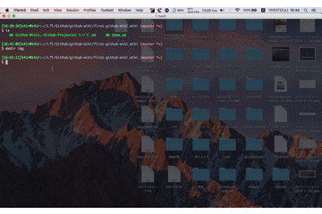

これはGitHubでソースコード管理しかしたことがない自分を含めた初心者用のメモになります(英語の勉強も含めて)。  
かなりくだいてメモしていますが、もしよければご覧ください(時間が空いたときにちょこちょこ書きます)
<br>
<br>
※ これは`2018/10/27`時点のものです  
環境は
- MacOS: 10.11.6
- git version: 2.13.1  

です
<br>
<br>
## 0. 目次
1. [GitHub Wikisとは](#section1)
2. [実際に `GitHubWikis` を使ってみる](#section2)
3. [ローカルでWikiを編集する](#section3)
4. [画像を貼る](#section4)
5. [自分の感想(あとで更新します)](#section5)
6. [追記](#section6)
7. [お世話になったサイトさまたち](#section7)


## <a name="section1">1. GitHub Wikisとは</a>
`GitHub Wikis`は下記のような場合に使われることがあるといいます
- どのような経緯、原則などより詳細な内容を伝えたい
- `README.md`より詳細な内容を伝えたい  

> GitHub Wikis are a place in your repository where you can share long-form content about your project, such as how to use it, how it's been designed, manifestos on its core principles, and so on. Whereas a README is intended to quickly orient readers as to what your project can do, wikis can be used to provide additional documentation.<br><br>
>>引用： [About GitHub Wikis](https://help.github.com/articles/about-github-wikis/)

<br>
では README.md はどのように使うのかというと

- そのリポジトリの機能をインストールすることでできるようになること
- インストールの仕方、使い方  
- 分りやすいような画像(gifは見ていて使うイメージが湧く)  

を簡潔にまとめたもので`クイックスタートガイド的なやつ`って自分では思ってます。
<br>
<br>

では`Wiki`と`README`の違いとは...  

>|  | README | Wiki |
>|:-----------:|:------------:|:------------|
>| 更新頻度 | 頻繁 | ほとんど無い |
>| PullRequestに | 含めたい | 含めなくて良い |
>| 管理者 | 開発者 | 例えばPOやディレクター |
>| 内容 | 開発者用 | システム利用者用 |
>一番違うのはREADME.mdは同一リポジトリだけど、Wikiは別リポジトリという点だと思う
>両方管理するとしたら、例えばこんな観点で分けると良いんじゃあないかな  
>>引用: [readmeとwikiの違い](https://qiita.com/suzuki-hoge/items/1d6022cca177e2d96bb5#readme%E3%81%A8wiki%E3%81%AE%E9%81%95%E3%81%84) 
<br>

とってもわかりやすい:laughing::laughing::laughing:
<br>

## <a name="section2">2. 実際に `GitHub Wikis` を使ってみる</a>
1. レポジトリを作成する
    1. 右上の  
      `+`  :arrow_right: `new repository` をクリック:point_up_2:
    2. Repository name（リポジトリの名前）: 任意の名前を入力(`-` と `_` は使える)
    3. 問題なければ `Create Repository`をクリック:point_up_2:

2. Wiki ページを作成する
    1. `1-iii`クリック後の遷移画面の `Wiki` をクリック:point_up_2:
    2. 中央の`Create the first page` をクリック:point_up_2:
    3. 遷移先のページ下部の`Save Page` をクリック:point_up_2:
<br>
<br>


## <a name="section3">3. ローカルでWikiを編集する</a>
- もちろんGitHubのWikiもGitで管理できます。:v:  
- ローカルで編集して`GitHub`へpushしたほうが早いです。:red_car::dash::dash::dash:  
- markdownファイルエディタで書くことに慣れている人は `Wiki` をGitHubで編集しようとすると結構大変です(イライラします:triumph:)<br>

そこで`git clone`でローカルに落としてきて編集して、`git push`で公開するという方法を使います。
1. Wikiのリポジトリをクローンする
    1. Wikiページの右下の`Clone this wiki locally`の内容をコピー(クリックする:point_up_2:)
    2. `bash`で`git clone <コピーしたやつをペースト>`を実行する
2. クローンしてきたファイルを実際に編集する
    1. 変更(更新)が終わったら
    2. `bash`で新しくローカルに出来た`<自分のリポジトリ名>.wiki`フォルダに移動する
    3. 通常と同じようにpushする
        ```bash
        # bashで編集しているファイルがあるWikiのフォルダに移動して
        git add .

        git commit -m "お好きにどうぞ"

        git push origin master
        ```
        すれば`GitHub`の`Wiki`にも反映されます:exclamation::exclamation:
<br>
<br>

## <a name="section4">4. 画像を貼る</a>
分りやすいように画像(`jpg`や`gif`)をつけたい時があります。:octocat:  
そんなときは下記の手順でできるようになります。  
>※ 下記で使っている`tree`コマンドはカレントディレクトリのディレクトリ構造をbashで表示するコマンドです。  
>標準では入っていないので使いたい場合は`Bash`で
>```bash:bash
>brew install tree
>```
>を実行してください。インストールがうまくいけば`tree`コマンドが使えるようになります。

1. まずはディレクトリ構造を確認(わたしの場合はこんな感じでした)
    ```bash:Bash
    $ tree
    .
    ├── GitHub-Wikis,-GitHub-Projects�\201��\201��\201\204�\201�.md
    └── Home.md
    ```
2. 画像を入れるフォルダを作成(その中に画像も入れておく、今回はgifにしました)
    ```bash:Bash
    .
    ├── GitHub-Wikis,-GitHub-Projects�\201��\201��\201\204�\201�.md
    ├── Home.md
    └── img
        └── sample.gif

    1 directory, 3 files
    ```
3. 画像をmdファイルで表示させる
    ```bash:
    # Markdownファイル
    # [リンク名](<ファイルの名前> "alt属性")
    
    ```
    で、`git push `すると反映されます:smiley:  
    実際はこんな感じになります<br>
    
<br>
<br>

## <a name="section5">5. 自分の感想</a>
もうちょっと使ってから書きます
<br>
<br>

## <a name="section6">6. 追記(2018/10/27)</a>
BitBucketでも同じようなことができます
- [【Bitbucket】Wikiを使ってみる](http://shikashikamemo.hatenablog.com/entry/2014/10/02/221415)  


他にもこんな良さげなものがありました  
- [GitHubカンニング・ペーパー](https://github.com/tiimgreen/github-cheat-sheet/blob/master/README.ja.md#github)
<br>
<br>


## <a name="section7">7. お世話になったサイトさまたち</a>
>- [Github Help(英語)](https://help.github.com/categories/wiki/)
>- [GitHub Wikiの編集ノウハウ](https://github.com/doc-wiki-jp/wiki/wiki/GitHub-Wiki%E3%81%AE%E7%B7%A8%E9%9B%86%E3%83%8E%E3%82%A6%E3%83%8F%E3%82%A6)
>- [[github wiki] Wikiを管理する](https://qiita.com/suzuki-hoge/items/1d6022cca177e2d96bb5#github-wiki-wiki%E3%82%92%E7%AE%A1%E7%90%86%E3%81%99%E3%82%8B)
>- [GitHubを中心とした開発プロセス ドキュメント管理](https://qiita.com/suzuki-hoge/items/1d6022cca177e2d96bb5#github-wiki-wiki%E3%82%92%E7%AE%A1%E7%90%86%E3%81%99%E3%82%8B)
>- [【GitHub】GitHubのWikiを書く](http://tech.admax.ninja/2014/10/08/how-to-write-wiki-of-github/)
